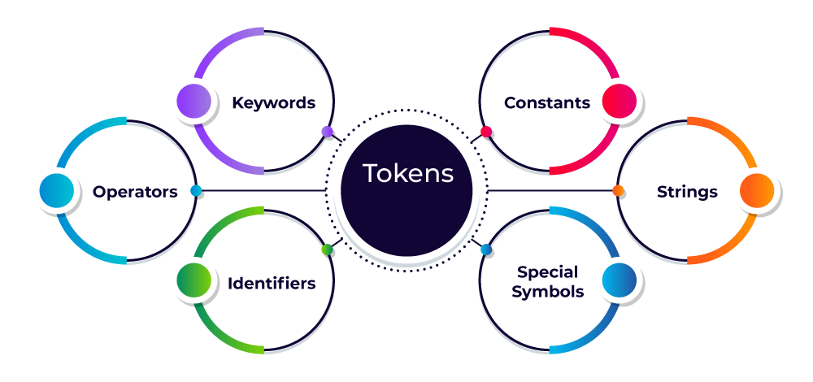

<h1 align="center" style="color: #27ae60;">Programming < /></h1>
Programming is making something to do some work using some instructions. Memorizing the Program and making other one is Learning. 

## Concepts : 
Todo: Things about loops and definations and all. 

## Tokens

Tokens are the smallest meaningful elements in source code, identified during lexical analysis.

### 1. Keywords
Reserved words with special meaning, such as:
| **Keyword**     | **Definition** | **Python** | **Java** | **C++** | **JavaScript** |
|:---------------:|:--------------|:----------:|:--------:|:-------:|:--------------:|
| `if`            | Conditional   | ✓ | ✓ | ✓ | ✓ |
| `else`          | Alternate branch | ✓ | ✓ | ✓ | ✓ |
| `while`         | Loop with condition | ✓ | ✓ | ✓ | ✓ |
| `for`           | Counting loop | ✓ | ✓ | ✓ | ✓ |
| `return`        | Exit function | ✓ | ✓ | ✓ | ✓ |
| `class`         | Define class  | ✓ | ✓ | ✓ | ✓ |
| `def`           | Define function | ✓ |   |   |   |
| `import`        | Include module | ✓ | ✓ |   | ✓ |
| `try`           | Start exception block | ✓ |   |   | ✓ |
| `except`        | Handle exception | ✓ |   |   |   |
| `with`          | Context manager | ✓ |   |   |   |
| `as`            | Alias assignment | ✓ |   |   |   |
| `lambda`        | Anonymous function | ✓ |   |   |   |
| `yield`         | Generator output | ✓ |   |   | ✓ |
| `interface`     | Contract for classes |   | ✓ |   |   |
| `public`        | Public access |   | ✓ | ✓ |   |
| `private`       | Private access |   | ✓ | ✓ |   |
| `protected`     | Protected access |   | ✓ | ✓ |   |
| `static`        | Class-level member |   | ✓ | ✓ | ✓ |
| `void`          | No return value |   | ✓ | ✓ |   |
| `package`       | Namespace |   | ✓ |   |   |
| `extends`       | Inherit class |   | ✓ |   | ✓ |
| `implements`    | Implement interface |   | ✓ |   | ✓ |
| `int`           | Integer type |   |   | ✓ |   |
| `float`         | Floating type |   |   | ✓ |   |
| `char`          | Character type |   |   | ✓ |   |
| `struct`        | User data type |   |   | ✓ |   |
| `typedef`       | Type alias |   |   | ✓ |   |
| `enum`          | Enumerated type |   |   | ✓ | ✓ |
| `const`         | Immutable value |   |   | ✓ | ✓ |
| `break`         | Exit loop |   |   | ✓ | ✓ |
| `continue`      | Next loop iteration |   |   | ✓ | ✓ |
| `namespace`     | Scope for names |   |   | ✓ |   |
| `template`      | Generic code |   |   | ✓ |   |
| `new`           | Allocate object |   | ✓ | ✓ | ✓ |
| `delete`        | Deallocate object |   |   | ✓ | ✓ |
| `this`          | Current object |   | ✓ | ✓ | ✓ |
| `operator`      | Overload operator |   |   | ✓ |   |

s
### 3. Literals
Fixed values written directly in code:

| **Type**    | **Python**   | **Java**   | **C++**     | **JavaScript** |
|:-----------:|:------------:|:----------:|:-----------:|:--------------:|
| Integer     | `42`         | `42`       | `42`        | `42`           |
| Float       | `3.14`       | `3.14f`    | `3.14f`     | `3.14`         |
| String      | `"hi"`       | `"hi"`     | `"hi"`      | `"hi"`         |
| Char        | `'a'` (string) | `'a'`   | `'a'`       | `'a'` (string) |
| Boolean     | `True`       | `true`     | `true`      | `true`         |
| Null/None   | `None`       | `null`     | `nullptr`   | `null`         |
s
### 4. Operators

Operators are symbols that perform operations on variables and values. Here’s a comparison of common operator types across Python, Java, C++, and JavaScript:

| **Type**      | **Python**         | **Java**             | **C++**              | **JavaScript**       |
|:-------------:|:------------------|:---------------------|:---------------------|:---------------------|
| Arithmetic    | `+`, `-`, `*`, `/`, `%`, `**`, `//` | `+`, `-`, `*`, `/`, `%` | `+`, `-`, `*`, `/`, `%`, `++`, `--` | `+`, `-`, `*`, `/`, `%`, `**` |
| Assignment    | `=`, `+=`, `-=`, `*=`, `/=`, `%=` | `=`, `+=`, `-=`, `*=`, `/=`, `%=` | `=`, `+=`, `-=`, `*=`, `/=`, `%=` | `=`, `+=`, `-=`, `*=`, `/=`, `%=`, `**=` |
| Comparison    | `==`, `!=`, `<`, `>`, `<=`, `>=` | `==`, `!=`, `<`, `>`, `<=`, `>=` | `==`, `!=`, `<`, `>`, `<=`, `>=` | `==`, `!=`, `===`, `!==`, `<`, `>`, `<=`, `>=` |
| Logical       | `and`, `or`, `not` | `&&`, `||`, `!`      | `&&`, `||`, `!`      | `&&`, `||`, `!`      |
| Bitwise       | `&`, `|`, `^`, `~`, `<<`, `>>` | `&`, `|`, `^`, `~`, `<<`, `>>`, `>>>` | `&`, `|`, `^`, `~`, `<<`, `>>`, `>>>` | `&`, `|`, `^`, `~`, `<<`, `>>`, `>>>` |

### 5. Separators (Delimiters)
Characters that separate tokens:
- Parentheses: `(`, `)`
- Braces: `{`, `}`
- Brackets: `[`, `]`
- Semicolon: `;`
- Comma: `,`

### 6. Comments
Comments are ignored by the compiler/interpreter and are used for documentation or explanation. Here’s how comments are written in different languages:

| **Type**        | **Python**           | **Java**                | **C++**                | **JavaScript**         |
|:---------------:|:--------------------:|:-----------------------:|:----------------------:|:----------------------:|
| Single-line     | `# comment`          | `// comment`            | `// comment`           | `// comment`           |
| Multi-line      | `''' comment '''` or `""" comment """` | `/* comment */` or `/** comment */` | `/* comment */`        | `/* comment */`        |
| Docstring       | `""" docstring """`  | `/** Javadoc */`        | (not standard)         | (not standard)         |
