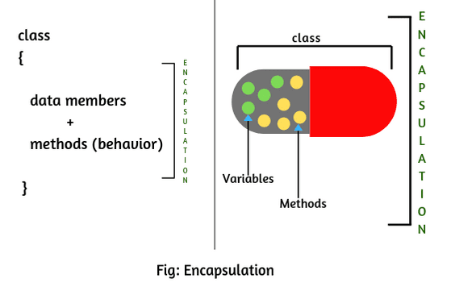

<h1 style="text-align: center; color:rgb(82, 179, 215);">Object Oriented Programming</h1>

A class in the OOP paradigm is just a blueprint for creating objects, which includes some data (Attributes) and Functions (Methods).

## Characteristics of OOP

### 1. Encapsulation  

    

Encapsulation is the process of hiding implementation details using Access Modifiers(Public, Private or Protected).

### 2. Inheritance  

    

Acquiring the properties (fields) and behaviors (methods) of an existing class (called parent or superclass) in a new class (called child or subclass).

### 3. Abstraction  

    

Hiding complex implementation details and showing only essential features of an object.Using Abstract  (Clear this doubt about encapsuplation with a example here)

### 4. Polymorphism  

    

The ability of one thing to take multiple forms, or using a Function or Class again without changing it.

can Be achived by - 

- **Compile-Time Polymorphism** (Method Overloading)

    When multiple methods in the same class have the same name but different parameters (type, number, or order of parameters).
- **Runtime Polymorphism** (Method Overriding)

    When a **subclass** provides a specific implementation of a method that is already defined in its parent class.

## Oops in Java