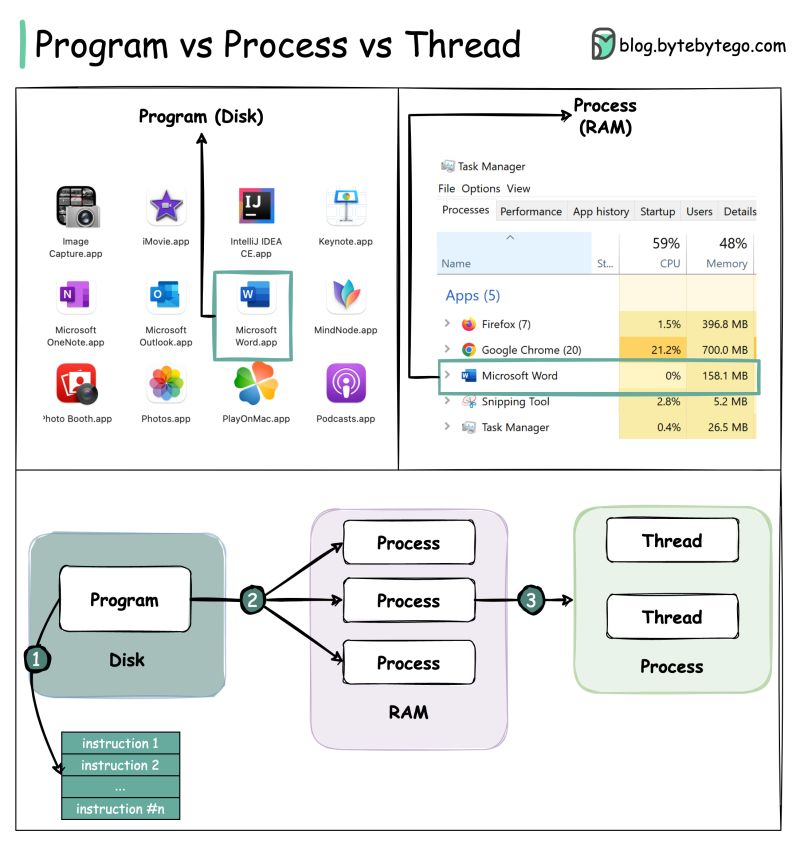

# Concurrency

Runninng form of the program is called Process.

Background Processes are called - Daemons or services 

## Critical Section Problem

A Critical Section is a part of the code where shared resources are accessed. The goal is to ensure that only one process enters the critical section at a time.

To solve this, three conditions must be satisfied (Critical Section Problem Solution Requirements):

- **Mutual Exclusion** — Only one process can be in its critical section at a time.
- **Progress** — If no process is in the critical section, and some processes wish to enter, one of them must eventually enter.
- **Bounded Waiting** — No process should wait forever to enter its critical section.

It can Be solved by:
Locking Mechanism 

## Samaphores 
They work on Locking Mechanism, It is just a integer value used to get in and out of the Critical Section.
Read this [article on semaphores](https://preshing.com/20150316/semaphores-are-surprisingly-versatile/).
