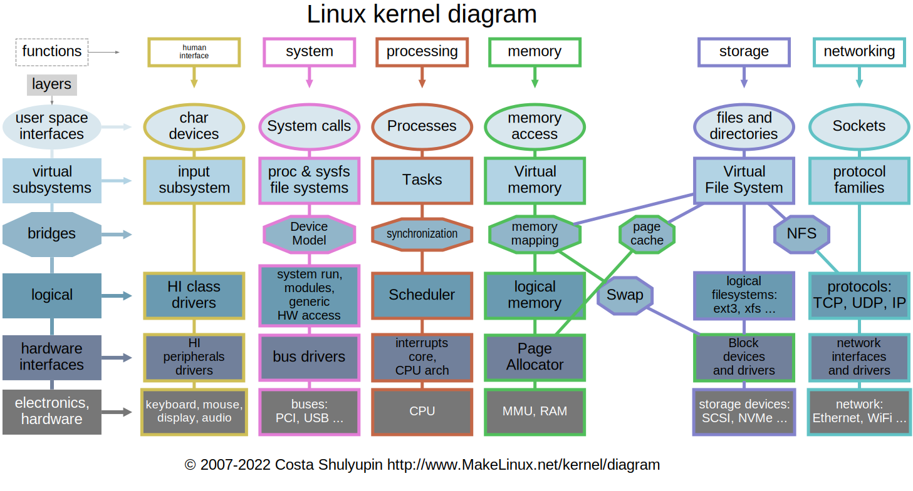

<h1 align="center" style="color: hsl(346, 84.50%, 62.20%);"> Operating Systems 💾 </h1>


**Operating Systems**: An operating system (OS) is system software that acts a Intermiedate between Hardware and Software.


## History


## [Types of Operating Systems](https://www.geeksforgeeks.org/types-of-operating-systems/)
### 1. Batch Operating Systems 

<div align="center">
    
</div>

This is used in the Third Generation Computers. 
- The System works in Batches (Compilation of same tasks)
- They where not Real-Time (No real time user Interaction)
- Used In First Generation Computers.
- **Ex** : IBM’s OS/360

### 2. Time-Sharing (Multi-Tasking) Operating Systems

<div align="center">
    
</div>

This is used in the Second Generation Computers, when Batch became slow and CPU have to sit idle. 

- In this, Users shares the **single** CPU and then it works as a Round Robin with a shared time called **Time Slice** or **Quantum**
- High Overhead (Use of Resources) and can Have Security vulnerabilites with memory leaks 
- **Ex** : Unix, Windows NT

### 3. Multi-Processing 

<div align="center">
    
</div>

This is used in the Fourth Generation Computers, Where we can have multiple processors and they can run multi tasks aswell.
- In this User have multiple Processor and work can be parallized and can be done by any of them. 
    - Symmetric Multiprocessing (SMP)
    - Asymmetric Multiprocessing (ASMP)
- **Ex** : Linux, Windows 95, MacOS and all new OS

### 4. Distributed Operating Systems

<div align="center">
    
</div>

Distributed Operating Systems manage a group of independent computers and make them appear to the users as a single computer. These systems coordinate the processing and sharing of resources across multiple machines connected via a network.Like figma.

- Resources and tasks are distributed among multiple computers.
- Provides better performance, reliability, and scalability.
- Users can access remote resources as if they are local.
- **Ex**: Amoeba, Plan 9, Google Fuchsia

## Components of OS

<div align="center">
    
</div>

### [System Calls](https://www.youtube.com/watch?v=H4SDPLiUnv4)

<div align="center">
    
</div>

System calls provide the interface between user applications and the operating system kernel. They allow user-level processes to request services(Hardware operations) such as file operations, process control, and communication from the OS.

- They are just API to Hardware.
- A system call makes a interupt(switch of CPU mode), which grants the control of the process to OS so it can use hardware.
- Examples: `read()`, `write()`, `fork()`, `exec()`, `open()`, `close()`
- System calls are essential for security and stability, as they prevent direct hardware access by user programs.
- They can cause compatibility problems like windows have different systemcalls and linux have different.


# [Kernal vs Operating System - ](https://www.geeksforgeeks.org/difference-between-operating-system-and-kernel/)
Kernal is a part of the Operating System, there are different types of kernal on the basis of how much work of Operating system is done by kernal.

[Here](https://www.geeksforgeeks.org/kernel-in-operating-system/)



# [Shell](./Shell.md)
Shell are the Command line interface between Kernal and the User.There are different shells out there - 
bash, powershell,zsh, fish etc.

# Files : 
In linux everything is a file, if its a directory that means it is a file. a symbolic link everything is a file. 
opposite to file is a Process.

## File Permission - 


you can change the permissions using - 
```bash
    chmod u+r ./file_name 
    # chmod u/g/o +/- r/w/x 
```

## Type of files - 
        -: Regular file
        d: Directory
        l: Symbolic link
        c: Character device file
        b: Block device file
        p: Named pipe (FIFO)
        s: Sockets


# [File System :](https://web.cs.wpi.edu/~rek/DCS/D04/UnixFileSystems.html)
The disk Partitions are called file system. Use `dumpe2fs` to get the file system information. 

## Types of File System Blocks in Linux

A Linux file system organizes data on disk using several types of blocks, each serving a specific purpose:

### 1. Boot Block
- Located at the very beginning of the file system.
- Contains the boot loader or code required to boot the operating system.
- Only present in bootable partitions.

### 2. Super Block
- Stores critical information about the file system, such as:
    - File system type
    - Size
    - Status
    - Metadata about other blocks (e.g., number of inodes, data blocks)
- Essential for mounting and managing the file system.

### 3. Inode Block
- Contains inodes, which store metadata about files and directories:
    - File type, permissions, owner, timestamps
    - Pointers to data blocks
- Each file or directory has a unique inode.

### 4. Data Block
- Stores the actual contents of files and directories.
- Most of the disk space is allocated to data blocks.
- Inodes point to these blocks to access file data.

These blocks together enable efficient storage, retrieval, and management of files in Linux file systems.