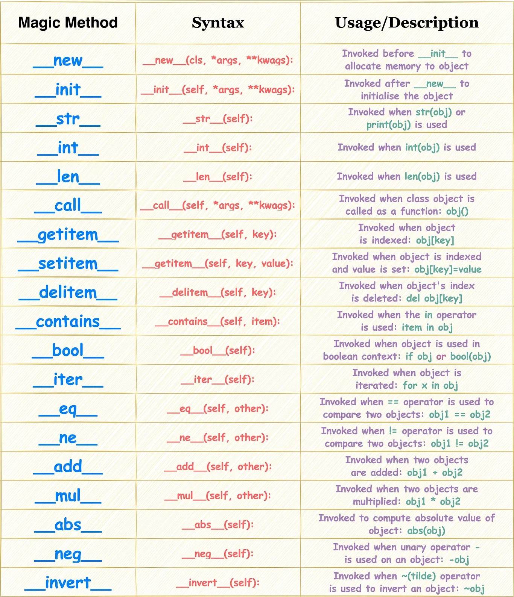
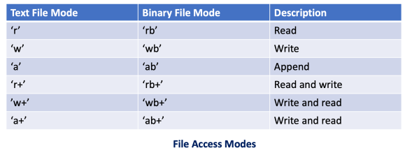

# 🐍 Python Notes

## 1. Basics

### Variables
You know what are they, you just need `=` assignment operator, to assign variable.

```python 
    x = 10                  # Integer
    name = "Alice"          # String
    pi = 3.14               # Float
    is_valid = True         # Boolean

    # Multi Assignment: 

    x,y,z = 1,2,3 
    x = y = z = 1 

```

### Operators:

#### 1. Arithmetic Operators

Used to perform mathematical operations.

| Operator | Description             | Example         |
|----------|-------------------------|-----------------|
| +        | Addition                | 5 + 2 = 7       |
| -        | Subtraction             | 5 - 2 = 3       |
| *        | Multiplication          | 5 * 2 = 10      |
| /        | Division (float)        | 5 / 2 = 2.5     |
| //       | Floor Division          | 5 // 2 = 2      |
| %        | Modulus (Remainder)     | 5 % 2 = 1       |
| **       | Exponentiation          | 5 ** 2 = 25     |

#### 2. Comparison (Relational) Operators

Used to compare two values and return a boolean result.

| Operator | Meaning                  | Example              |
|----------|--------------------------|----------------------|
| ==       | Equal to                 | 5 == 2 → False       |
| !=       | Not equal to             | 5 != 2 → True        |
| >        | Greater than             | 5 > 2 → True         |
| <        | Less than                | 5 < 2 → False        |
| >=       | Greater than or equal to | 5 >= 2 → True        |
| <=       | Less than or equal to    | 5 <= 2 → False       |

#### 3. Logical Operators

Used to combine conditional statements.

| Operator | Meaning      | Example                          |
|----------|-------------|----------------------------------|
| and      | Logical AND | (5 > 2) and (5 < 10) → True      |
| or       | Logical OR  | (5 < 2) or (5 < 10) → True       |
| not      | Logical NOT | not (5 > 2) → False              |

#### 4. Assignment Operators

Used to assign values to variables.

| Operator | Example    | Equivalent      |
|----------|------------|----------------|
| =        | x = 5      | x = 5          |
| +=       | x += 3     | x = x + 3      |
| -=       | x -= 3     | x = x - 3      |
| *=       | x *= 3     | x = x * 3      |
| /=       | x /= 3     | x = x / 3      |
| //=      | x //= 3    | x = x // 3     |
| %=       | x %= 3     | x = x % 3      |
| **=      | x **= 3    | x = x ** 3     |

#### 5. Bitwise Operators

Operate on bits (binary level).

| Operator | Name        | Example           |
|----------|-------------|-------------------|
| &        | AND         | 5 & 3 = 1         |
| \|       | OR          | 5 \| 3 = 7        |
| ^        | XOR         | 5 ^ 3 = 6         |
| ~        | NOT (invert)| ~5 = -6           |
| <<       | Left Shift  | 5 << 1 = 10       |
| >>       | Right Shift | 5 >> 1 = 2        |

---

### Data Types

```python
# Lists
fruits = ["apple", "banana", "cherry"]  # List of strings

# Tuples
point = (1, 2)             # Immutable ordered data

# Sets
unique_nums = {1, 2, 3}    # Unordered, no duplicates

# Dictionaries
person = {"name": "Alice", "age": 25}  # Key-value pairs
```

---

## 3. Control Flow

```python
# Conditional statements
if x > 5:
    print("x is greater than 5")
elif x == 5:
    print("x is 5")
else:
    print("x is less than 5")

# Loops
for fruit in fruits:               # Iterate over list
    print(fruit)

while x > 0:                       # While loop
    print(x)
    x -= 1
```

---

## 4. Functions

```python
# Define a function

def greet(name) -> str:              
    # -> shows the return type! Its not Javascript relax
    
    print(f"Hello, {name}!")

    return f"Hello, {name}!"

# Call the function

greet("Rishubh Johnson!")

#Change the Name of the function 
namaste = greet

namaste("Niko Bellic!")


# Wrapper Functions - They are just the wrapper to the older functions 

def greet(name):
    print(f"{name} is a Moron!")

def wrapper(func):

    def wrapped_greet(name):
        print(f"You know who is the Moron!!!!")
        func(name)
    return wrapped_greet                   
    # It Returns the defination of the function.


    # That Defination is now in new_greet i.e 
    # new_greet = wrapped_great 

new_greet("Rahul")

# Decorators - istead of writing - new_greet = wrapper(greet)

@wrapper
def greet(name):
    print(f"{name} is a Moron!")

# Lambda Function - One Liner functions. (Syntax sex!)

def function_caller(func):
    func("Subhash")


function_caller(lambda a : print(f"{a} is a Moron"))

# Same as new_name = lambda a : print(f"{a} is a Moron!")


```

Learn about Decorators from this: [Here](https://www.youtube.com/watch?v=ZwMS3_Ej_6M&ab_channel=SkillBakeryStudio)
---

# 5. Classes and OOP

[Reference](https://www.youtube.com/watch?v=rLyYb7BFgQI&ab_channel=Indently)

```python
# Define a class
class Person:
    def __init__(self, name, age):   # Constructor
        self.name = name
        self.age = age

    def greet(self):
        print(f"Hi, I'm {self.name} and I'm {self.age} years old.")

class Man(Person):   # This is Inherited from the Person.

    def __init__(self,name,age,penile_size):
        super().__init__(name,age)  # Calling from the Parent Class.
        self.penile_size = penile_size

    def greet(self):                # You can overide the parent class functions
        print(f"Hi, I'm {self.name} and I'm {self.age} years old with a {self.penile_size}. inch penis")


# Create object
p = Man("Alice", 25,12)w
print(greet()) 

```

## Dunder Methods (Double Underscore Methods/Magic methods) 
They are special/magic methods in the classes for basic functionality and operators [see](https://www.youtube.com/watch?app=desktop&v=NwjSP1_WEfE&ab_channel=BroCode)

```python
class Person:
    def __init__(self, name):
        self.name = name

    def __str__(self):
        return f"Person named {self.name}"

p = Person("Alice")
print(p)  # Output: Person named Alice
```


---

# 6. Exception Handling

```python
try:
    result = 10 / 0
except ZeroDivisionError:
    print("You can't divide by zero!")
```

# 7. *Args and **Kargs

In Python, `*args` and `**kwargs` are used in function definitions to handle **variable numbers of arguments**.

`*args` & `**kargs` allows a function to accept **any number of positional arguments**.

`*args` is a **tuple**
`**kargs` is a **Dictionary** 

[More Information](https://www.youtube.com/watch?v=Vh__2V2tXUM)

### Example:

```python
def print_numbers(*args):
    for number in args:
        print(number)

print_numbers(1, 2, 3, 4)


def print_info(**kwargs):
    for key, value in kwargs.items():
        print(f"{key}: {value}")

print_info(name="Alice", age=25, country="Wonderland")

```

# 8. Virtual Environment

They are environments that encapsulate a Python project so you can freeze the dependencies and all.
They make a new Python interpreter in the virtual environment.

## Creating a Virtual Environment

With the built-in `venv` module (Python 3.3+):

```bash
python -m venv venv
```
Then activate the new interpreter (set the interpreter in the editor as well!)

On Windows: 

```bash 
venv\Scripts\activate
```
On Linux: 

```bash
source venv/bin/activate
```

# 9. UV (Package and Project Manager) 

```bash
uv init project_name
uv venv
source ./venv/bin/activate

uv pip install package
```

# 10. Files 

You can open a file or make a python object of the file using open(), which is a constructor that makes an instance of a `_io.TextWrapper` class.  
Example:

```python
my_file = open("/path/to/the/file","mode")
```

All the modes: 



## Attributes and Methods: 

## File Object Methods & Attributes

### 1. Reading Functions

| Method                | Description                                                      |
|-----------------------|------------------------------------------------------------------|
| `read(size=-1)`       | Reads `size` characters (or entire file if `-1`)                 |
| `readline(size=-1)`   | Reads a single line (up to optional `size` bytes)                |
| `readlines(hint=-1)`  | Reads all lines into a list (can limit total bytes with `hint`)  |
| `readable()`          | Returns `True` if file is open for reading                       |

### 2. Writing Functions

| Method                | Description                                                      |
|-----------------------|------------------------------------------------------------------|
| `write(string)`       | Writes string to file                                            |
| `writelines(lines)`   | Writes a list of strings to file (no automatic newlines)         |
| `flush()`             | Forces writing of buffer to disk                                 |
| `writable()`          | Returns `True` if file is open for writing                      |

### 3. File Pointer (Position Control) Functions

| Method                        | Description                                              |
|-------------------------------|----------------------------------------------------------|
| `seek(offset, whence=0)`      | Moves file pointer to a specified position               |
| `tell()`                      | Returns the current position of the file pointer         |
| `seekable()`                  | Returns `True` if file supports random access (seek/tell)|

### 4. File Information / Property Methods

| Method        | Description                                         |
|---------------|-----------------------------------------------------|
| `fileno()`    | Returns OS-level file descriptor (an integer)       |
| `isatty()`    | Returns `True` if file is connected to a terminal   |

### 5. File Management / Closing Functions

| Method / Attribute | Description                        |
|--------------------|------------------------------------|
| `close()`          | Closes the file                    |
| `closed`           | Returns `True` if file is closed   |

### 6. File Object Attributes

| Attribute  | Description                                         |
|------------|-----------------------------------------------------|
| `name`     | The name of the file                                |
| `mode`     | The mode in which file is opened (e.g., `'r'`, `'w'`)|
| `closed`   | Returns `True` if file is closed                    |

### 7. Special Context Manager Methods (for `with` statement)

| Method         | Description                                                        |
|----------------|--------------------------------------------------------------------|
| `__enter__()`  | Enters the runtime context and returns the file object             |
| `__exit__()`   | Exits the runtime context and closes the file                      |
