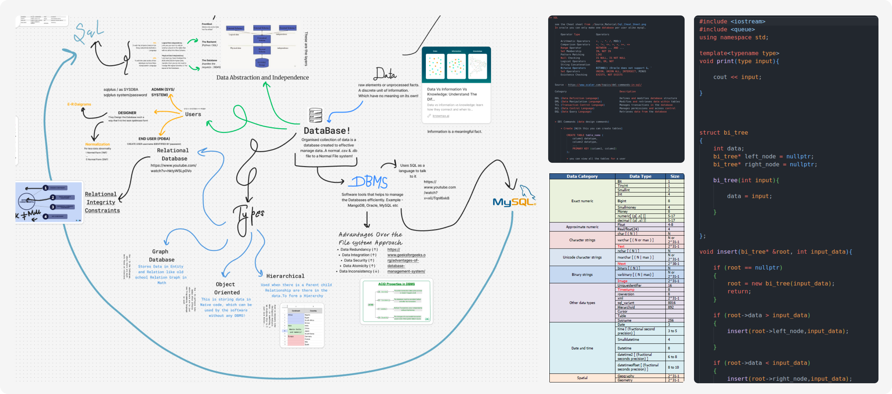

<h1 style="font-size: 200%;">∑ Learning Repository</h1>




Welcome to the **Learning** repository! 📚🚀 This is my personal knowledge base where I store all my study materials, notes, doodles, and code snippets that help me understand various topics.

## 📌 About This Repository
This repository is an organized collection of:
- 📖 **Study Materials** – Documents, PDFs, and references.
- 📝 **Notes** – Handwritten or typed notes on different subjects.
- ✍️ **Doodles** – Visual representations, mind maps, and diagrams.
- 💻 **Code Snippets** – Small scripts or programs to test concepts and enhance understanding.

## 📂 Folder Structure
```
Learning/
│-- 📁 Notes/          # Organized notes on various subjects
│-- 📁 Code/           # Sample codes and implementations
│-- 📁 Doodles/        # Diagrams and visual explanations
│-- 📁 Resources/      # Books, articles, and reference materials
│-- README.md         # This file
```

## 🚀 Topics Covered
The repository covers a wide range of topics, including but not limited to:
- 📌 **Mathematics** – Set Theory, Graph Theory, Numerical Methods, etc.
- 💻 **Programming** – C, C++, Python, JavaScript, SQL, etc.
- 🎨 **Design & UI/UX** – Concepts, principles, and implementations.
- 🎮 **Game Development** – Basics, physics, and engine-related learning.
- 📡 **Networking & Databases** – Data structures, algorithms, and protocols.

## 🔥 How to Use This Repository
Feel free to explore the contents and use them as a reference for your own learning. You can:
- Browse through the topics and pick what interests you.
- Use the code snippets for practice and experimentation.
- Read the notes and refer to the resources for deeper understanding.

## 📬 Contributions
This is my personal study space, but if you have suggestions or additional resources that might help, feel free to open an issue or drop a message! 😊

---
Happy Learning! 🚀📚